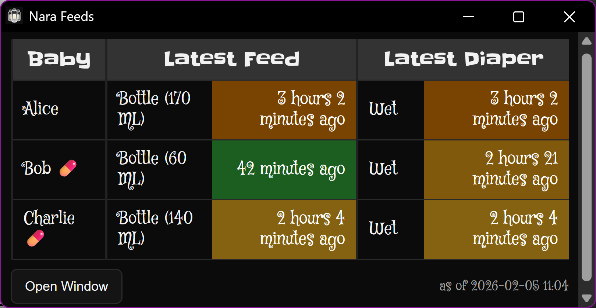

# Nara Gaiden

Nara Gaiden is a companion viewer for the
[Nara Baby tracking app](https://nara.com/pages/nara-baby-tracker-app).
Nara Gaiden is designed especially for raising multiple babies:
it lets you quickly see who was fed and changed when,
and who had vitamins or medication since midnight.

Given that Nara Baby doesn't offer an API,
Nara Gaiden takes the (rather hacky) approach
of grabbing the database from an Android emulator
running the Nara Baby app.
It offers the data via a web server,
which a web, Android, Wear OS, or iOS app can connect to.

The server can optionally require a password before serving any baby data.
Set `NARA_PASSWORD` in the environment or a local `.env` file if you want protection enabled.

## Web View



* Shows latest feeds and diaper changes (times and amounts) for each baby
* Time cells are color-coded by recency/urgency,
  smoothly transitioning between
  * green = up to 1 hour old
  * yellow = 2 hours old
  * orange = 3 hours old
  * red = 4+ hours old
* Name badges show emoji for certain routine tracking, since midnight:
  * 💊 for vitamins
  * 💉 for medication
  * 🛁 for baths
  * Repeat multiple times if given multiple times in the day
  * Hover over an emoji to see the routine name, note, and recorded time
* Updates immediately when the emulator database changes, and every minute

Open with `chrome --app=http://192.168.2.1:8888`
to get a window with no location bar or other chrome.

## Quick Start

1. Install [Android Studio](https://developer.android.com/studio).
2. Emulate a medium tablet with Play Store, install Nara Baby,
   and export the APK splits via:

   ```sh
   adb shell pm path com.naraorganics.nara
   adb pull /data/app/...path from above.../base.apk
   adb pull /data/app/...path from above.../split_config...
   ```

   In my case, I obtained four files (`base.apk`,
   `split_config.en.apk`, `split_config.x86_64.apk`,
   and `split_config.xhdpi.apk`) but your mileage may vary.

3. Emulate a medium tablet with Google APIs (no Play Store)
   and install the exported APK splits via:

   ```sh
   adb install-multiple -r base.apk split_config.*.apk
   ```

4. Start that Android emulator and sign into Nara Baby.
5. Optional: Try running the exporter:
   - `python nara_live_export.py`
   - Optionally set `ADB_DEVICE` to target the specific emulator/device.
6. Optional: create a local `.env` from `.env.example` and set settings.
   (`.env` is ignored by Git, so it stays local.)
   In particular:
    - Set `NARA_PASSWORD` if your server will be accessible outside your LAN.
    - To avoid having to start the Android emulator manually all the time,
      set `NARA_EMULATOR_AVD` to the name printed by `emulator -list-avds`
      (after running it once yourself and signing in).
7. Run the server:
    - `python nara_web.py --host 0.0.0.0 --port 8888 --adb-device emulator-5554`
    - (`--adb-device` should match whatever `adb devices` lists)
    - Settings can also be set via environment variables or a local `.env` file.
    - If pulling the app database fails with `Permission denied`,
      the server runs `adb root`, as needed to pull the Nara database.
    - If you set `NARA_EMULATOR_AVD` or pass `--emulator-avd NAME`,
      the server will launch (if needed) and supervise this Android emulator,
      defaulting to headless audio-free operation.
      The server waits for Android to boot, keeps
      `com.naraorganics.nara` in the foreground,
      restarts ADB after repeated failures, and
      restarts an emulator it launched if ADB recovery fails.
      See `.env.example` for optional arguments, intervals, and thresholds.
8. Connect web browser to `localhost:8888` (or modify to your IP address)
    for the web view.
   If `NARA_PASSWORD` is set, browsers will prompt for the password once and remember it locally.
9. For mobile apps, configure clients to point at your server:
    - iOS: copy `ios/Config/Local.xcconfig.example` to `ios/Config/Local.xcconfig` and set `NARAGAIDEN_SERVER_URL`, for example `https:/$()/your-host.example`.
    - Android: add `naraGaidenServerUrl=...` to `android/local.properties` or start from `android/local.properties.example`.
    - Both local config files stay out of Git.
   If `NARA_PASSWORD` is set, the Android and iOS apps will ask for the password on first `401` and reuse it afterward.
10. Build/install the Android, Wear OS, and/or iOS apps as desired:
    - iOS setup details: `ios/README.md`
    - Android + Wear OS setup details: `android/README.md`

## Technical Overview

1. Nara Baby runs inside an Android emulator on the server.
2. `nara_live_export.py` uses ADB to pull data from the emulator and produce JSON.
3. `nara_web.py` watches the emulator databases with `inotifyd`, uses lightweight
   `stat` checks as a fallback, serves JSON to apps, and serves an SSE-enabled web
   app to browsers.
4. Android phone app/widget polls the `/json` endpoint and syncs snapshots to the Wear OS app/tile.
5. iOS app/widget polls the `/json` endpoint and renders the overview.

## Components

- `nara_live_export.py`: pulls data from the Android emulator via ADB.
- `nara_web.py`: serves `/json` plus a web view optimized for multi-baby overview.
- `android/`: Android phone app + widget, plus Wear OS app/tile/complication.
- `ios/`: iOS app + widget.
